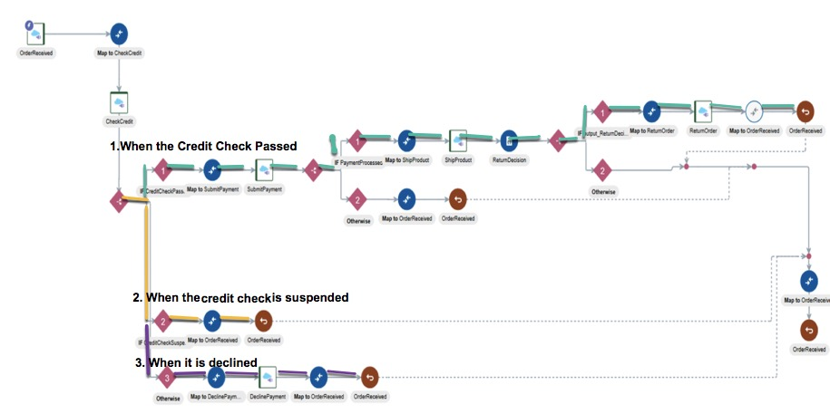
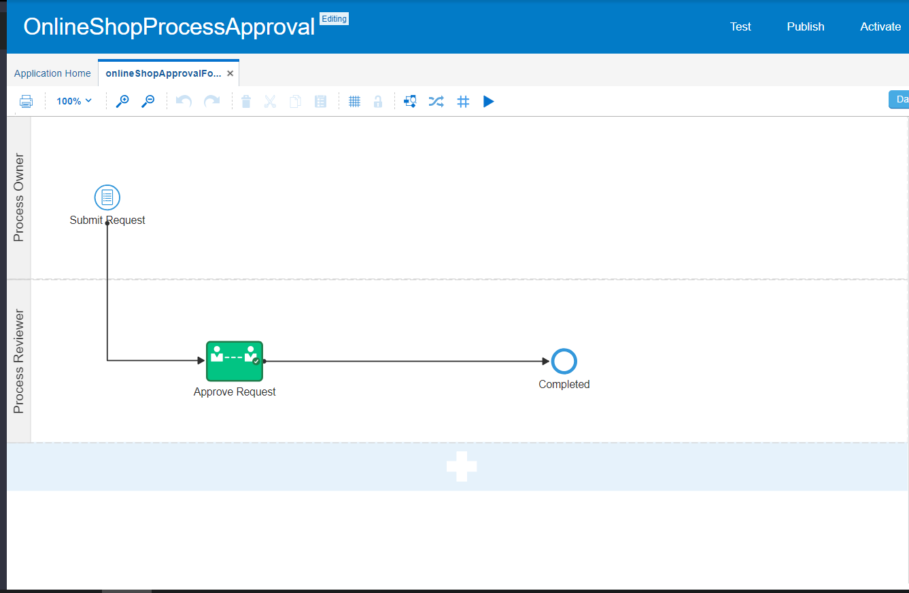

# Oracle Integration Day - Hands-on Workshop

> Updated: February 2019

## Upgrade To The Cloud: Oracle Integration Hands-on Workshop
A hands-on workshop to dive into development on Oracle's Integration Cloud Platform

## Overview
Enterprises can innovate faster, improve customer engagement, drive business-process efficiency, and accelerate digital transformation with Oracle Cloud. Oracle is the enterprise technology partner that positions companies for tomorrow, today; empowering businesses of all sizes on their journey of digital transformation. Oracle Cloud provides leading-edge capabilities in software as a service, platform as a service, infrastructure as a service, and data as a service.

At Oracle we have invested in delivering a plethora of new Cloud Services and we want to show you how simple – yet powerful they are. We specifically wanted to focus on low code, high productivity services that can be used in building enterprise grade solutions. We believe the best way to do this is to showcase a real world business solution comprised of these services. You will build the entire solution during the course of this workshop all in a stress-free fun environment. 

This workshop will focus on the following solution capabilities within Oracle Autonomous Integration Cloud (OIC).  
- Oracle Integration Capability delivers best in class “Hybrid” Integration. OIC is a simple and powerful integration platform in the cloud to maximize the value of your investments in SaaS and on-premises applications
- Oracle Process Automation Capability with an easy, visual, low-code process automation platform that simplifies day to day tasks by getting employees, customers, and partners the services they need to work anywhere, anytime, and on any device
- Oracle Visual Builder Capability to rapidly create and host engaging business applications with a visual development environment right from the comfort of your browser. 

## About OIC

Oracle Integration Cloud (OIC) brings together all the critical capabilities of a complete Application Integration, Process Automation, Visual Application Building and Integration Analytics solution into a single unified cloud service. Oracle Integration Cloud now brings real-time and batch based integration, structured and unstructured processes, case management, stream analytics, zero code integration insight etc, allowing customers to service all their end to end integration needs in one cohesive platform so that all users can now transition and collaborate across these capabilities and projects seamlessly.

## Oracle Integration Cloud Features

- Integrate Applications - Deliver integrations up to 6X faster with pre-built adapters for your SaaS and on-premises systems.

- Automate Processes - Streamline your digital workforce with an easy, visual, low-code process automation platform that simplifies day to day tasks by getting employees, customers, and partners the services they need to work anywhere, anytime, and on any device.

- Build Applications Visually - Rapidly create and host engaging business applications with a visual development environment right from the comfort of your browser. Define business objects, integrate data from external system, incorporate business processes, and design tailored interfaces to create your apps.

- Gain Insight - Gain real-time insight into end-to-end processes with guidance on best next steps for your business operational excellence and run massively parallel real-time analytics on streaming data for instant actionable insights. 

## Hands-on Lab Overview
 **Lab 1** This hands-on lab will allow participants to clone a sample integration flow and add 2 conditional branches. They will activate the flow and Test using a REST Client (i.e., Postman)

The OIC integration that we'll be working with is shown in the following picture:

Here is a description of what is happening with this integration:

A sample (half completed) integration flow will be provided for workshop participants to clone. Participants will make their cloned integration flow unique by adding their initials as prefix or suffix to the Cloned integration flow name. Participants will complete the integration flow and test the REST API with Postman. 

The integration flow uses other integration flows simulating *credit card validation*, *order payment* and *order shipment*. These other integration flows are exposed as REST API calls and provide examples of leveraging common integration flow components within OIC.

**Lab 2** This hands-on lab will allow participants to use the Process Automation capability with in OIC to implement a Business Process that will be triggered for Reject/Approve orders from online shopping API call.

The OIC integration for Process Automation that we'll be working with is shown in the following picture:

## Get Started: 
Open the navigation menu using the hamburger icon in the upper left of the menu bar to choose a lab guide and get started.

The hamburger menu has an icon that looks like this: 