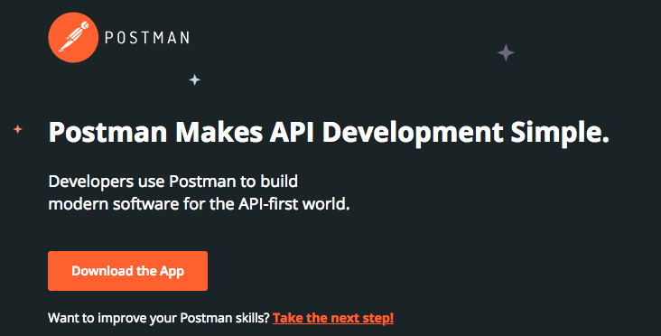
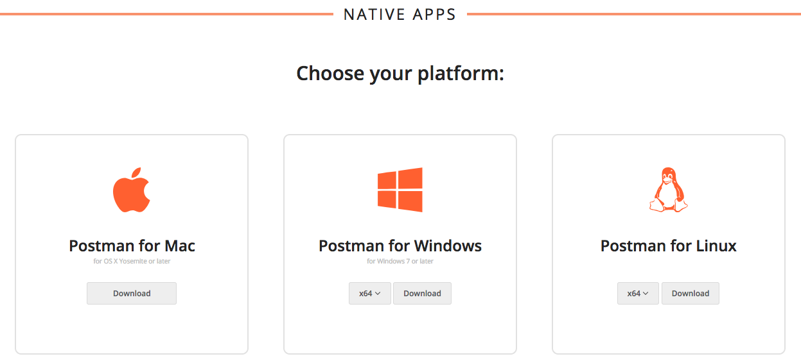
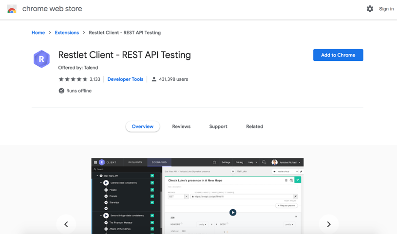

# Oracle Integration Cloud (OIC) Development Workshop Prerequisites

## Required 3rd Party Testing Tools

### Install Postman Client

We will use Postman to test 

If you don't already have Postman install on your workstation, you'll need to install.

To install Postman for testing the API Developement follow these instructions:

- Download the Postman application for your desktop/laptop from the URL:
<https://www.getpostman.com/>

- Select "Download the App" from the home page

- Click on ‘Add to Chrome’ button to start installation.

-  Select the platform that correlates to your machine

- Save the download file to a temporary directory on your workstation

- Run the installer and save Postman to your applications directory

### Install Restlet Client

Another option to test integration is by using Restlet Client add-on in Chrome.

If you don’t have the add-on already installed, you will have to install it in Chrome or Firefox browser.

To install Restlet Client in Google Chrome for testing API development follow these instructions:

- Install the add-on from the URL:
<https://chrome.google.com/webstore/detail/restlet-client-rest-api-t/aejoelaoggembcahagimdiliamlcdmfm?hl=en/>

---

---

## Supported Browsers

Most modern browsers including Chrome, Safari, Internet Explorer, Edge and Firefox are supported.

