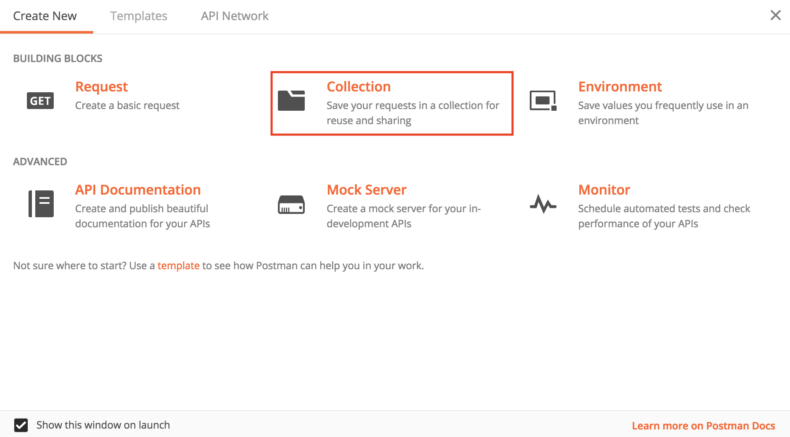
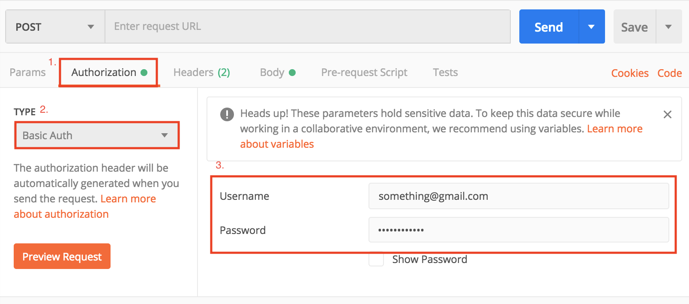
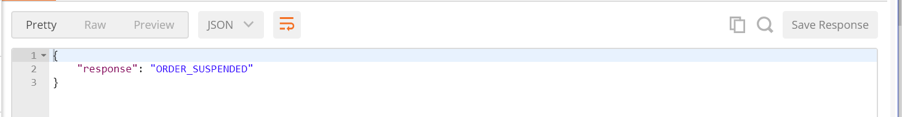
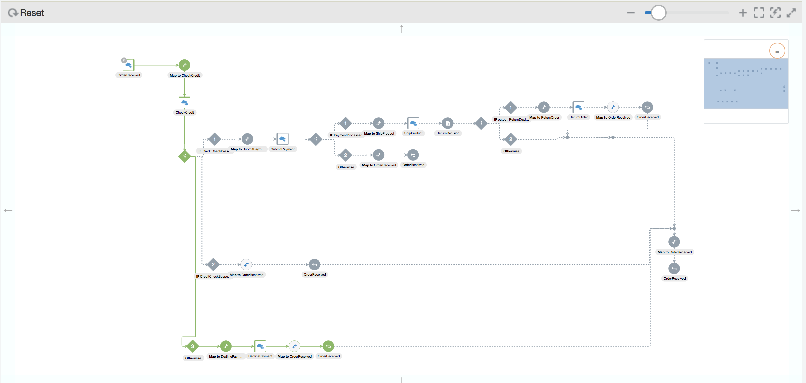
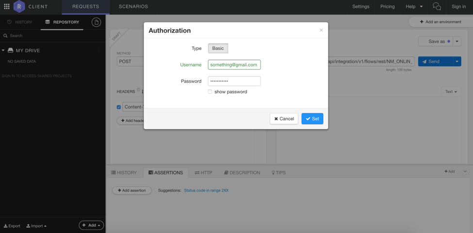
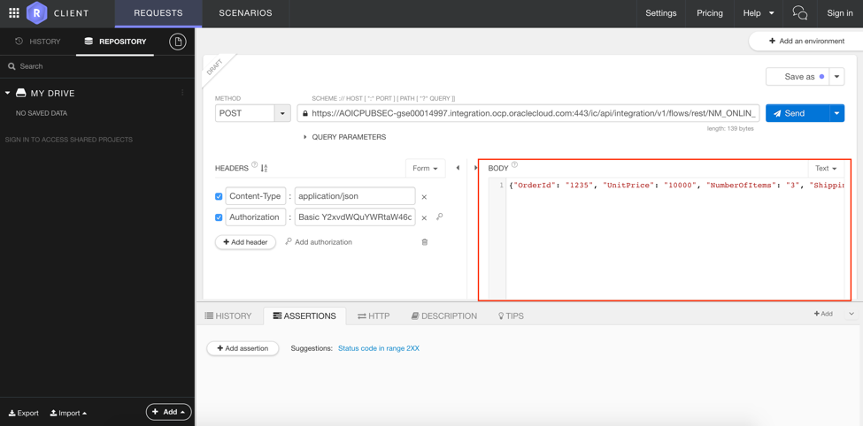

# Workshop Setup: Loading Workshop Integration Artifacts
## Introduction

In this Lab we are going to load the integration flows required to complete the development of Online Shopping Integration Flow 

---
## Objectives
Setup an Oracle Integration Instance with the Integration Components required to complete this workshop

## Required Artifacts

Download the integration Flows using the links below into a local drive on your Laptop

[Online Shopping Application Integration Flow ](https://oraclecps.github.io/oracleintegrationday/files/ONLINE_SHOPPING_APP_01.00.0000.iar)

[Online Shopping Application Payment Validation Integration Flow ](https://oraclecps.github.io/oracleintegrationday/files/ONLINESHOPPINGAPPPAYMENTVALIDATI_01.00.0000.iar)

[Online Shopping Application Fulfillment Integration Flow ](https://oraclecps.github.io/oracleintegrationday/files/ONLINE_SHOPPING_APP_FULFILLM_01.00.0000.iar)

[Sample Online Shopping Application Integration Flow ](https://oraclecps.github.io/oracleintegrationday/filesONLINE_SHOPPING_APP_SAMPLE_01.00.0000.iar)


### Login to your Oracle Cloud account

---

**1.1** From your browser (Firefox or Chrome recommended) go to the following URL:
<https://cloud.oracle.com>

**1.2** Click _Sign In_ in the upper right hand corner of the browser
**IMPORTANT** - Make sure `Cloud Account with Identity Cloud Service` is selected Under Cloud Account, Enter **Cloud Account Name** provided by your instructor and Click on `Next >` 


**1.3** Enter your `User Name` and `Password` and click **Sign In**

***NOTE:*** the **User Name and Password** values will be given to you by your instructor.

  

**1.4** You will be presented with a Dashboard displaying the various cloud services available to this account.

**NOTE:** The Cloud Services dashboard is intended to be used by the *Cloud Administrator* user role.  The Cloud Administrator is responsible for adding users, service instances, and monitoring usage of the Oracle cloud service account.  Developers and Operations roles will go directly to the service console link, not through the service dashboard.


**1.5** The Service Administrator can also look at Billing and Monitoring MetrAIC to understand how the service is being consumed by your Enterprise


**1.6** Selecting `View Details` link will take you to the Service Overview page where there are links for Billing and Monitoring Services. As this is a demonstration account, there is no Billing and Monitorin information available.


**1.7**  To get to Oracle Integration Cloud (OIC) service console where you will work on developing the integration, click on the `Open Service Console`. This will display OIC Service Instance Page listing all OIC Services provisioned in the Cloud Account.


**1.8**  Click on Hamburger menu for OIC Instance `<Instance Name>` and Select the `Open Integration Cloud Home Page` link to go to the OIC Welcome Page.  


### Load Integration Flows Into OIC Instance

**2.1** Click the integrations tab in the screen shot in 1.8 to open integration cloud Wizard under Designer tab as show in the screen shot below, you will be able to import via clicking on the import button on the top left corner.


**2.2** Click on import and chose the downloaded .iar files one by and  import as show in the screenshot below:


**2.3** After clicking on the chose file button an explorer window opens up for you to pick those downloaded .iar files select it and upload it as shown in the screenshot below:


**2.4** Repeat the **steps 2.2 and 2.3** for  the four .iar files.

Once all the files are successfully imported. Go to the connections tab as highlighted in the pic below:


**2.5** You should see four connections listed below 

1. Online Shopping Fulfillment (Trigger)

2. OnlineShoppingAppService  (Trigger)

3. OnlineShoppingFulfillmentInvoke  (Invoke)

4. OnlineShoppingPaymentInvoke(Invoke) 

as shown in the pic below:


Now you need to activate the connections.

**2.6** Invoking Online Shopping Fulfillment:

Click on the hamburger menu on the far left end in the pic as shown above and a menu will pop up which has Edit, View , Clone and Delete options available to it as highlighted in the screen below:


**2.7** Click on Edit and then click on test button as shown below:


**2.8** Once you click on test a message pops up on top saying “connection Online Shopping fulfillment was tested successfully” as shown in the screenshot below:


**2.9**  Now click on the close button and then click on the save button in the  window as shown below:


After doing that it will take you back to the connections page. Repeat the same steps for OnlineShoppingAppService connection which is a Trigger.

Once you have activated the Triggers you need to activate the invokes.

In order to activate the Online Shopping Fulfillment  Invoke you need to have the integration Online Shopping App Fulfillment activated.

**2.10** In order to activate the Online Shopping App Fulfillment Integration  click on the integrations tab on the left hand side and Integrations page will show up:


As highlighted in the picture above you in yellow in the Online Shopping App Fulfillment Integration and on the right side you can see a switch button which is highlighted in red , you need to move the button towards the direction where the arrow is pointing in order to enable or activate the integration.

**2.11** Once you move it towards the direction of arrow in the as show in the pic a window will popup as shown below:


**2.12** Select the Enable tracing and Include Payload as shown above, as these are useful for tracing errors during the debugging process and then click on the Activate button as shown above:


**2.12** Once activated click on the icon the side of the switch button to get the end point url as show in the pic below:


**2.13** Copy the endpoint url and go to the connections page and edit the Online Shopping Fulfillment Invoke Connection and click on the Configure connectivity button as shown in the image below:


**2.14** A window pops up in order to enter the connectivity details as shown below and click on ok button:


**2.15** After entering the connectivity details click on the security button and enter the security details as shown in the screenshot below:


**2.16** A window pops up for you to enter the user credentials as shown below. After entering the credentials click on the ok button:


**2.17** Now go back to the top and you will see that the percentage is 85% which means connection is 85% percent ready , now you need to click on the Test button as shown below:


**2.18** Once that is done you will get a prompt as connection tested successfully with 100% as shown below:


**2.19** Now you can hit save button to save the connection details, once you hit on save a window shows up with a confirmation on saving the changes, click on the save button on that window as shown below:


**2.20** And then click on the close button it will take you to the connections page with two active connections as shown in the pic below:


**2.21**  Click on the close button it will take you to the connections page with two active connections as shown in the pic below:


**2.22** Now go to Connections tab and edit the OnlineShoppingAppService(Trigger) and click on the Test button to make the connection active as shown below:


**2.23** Now close the connection and go to Integrations tab and activate the Online Shopping App integration . After activation capture the end point url as shown in the screen below:


**2.24** Now go to Connections tab and open the OnlineShoppingPaymentInvoke connection in edit mode and update the connection with details as below:
 
            i.      TLSv1.2
            ii.      https://OIC URL/ic/api/integration/v1/flows/rest/ONLINESHOPPINGAPPPAYMENTVALIDATI/1.0/metadata

Username and Password will be the credentials provided to you by the instructor.

refer to the screen below:


**2.25** Once all the details are given click on the Test button as shown in the screen below:


**2.26**And now click on the close button and go to Integrations.

In Integrations page activate the Online Shopping App Payment Validation as highlighted in the screenshot below:
 


**2.27** After activating the Online Shopping App Payment validation and then activating the OnlineShoppingPaymentInvoke Connection, Online Shopping App integration needs to be updated as shown in the pic below:


This way all the three Integrations Online Shopping App, Online Shopping App Fulfillment, Online Shopping App Payment Validation are activated successfully. 

### Online Shopping Integration Testing

Testing the activated integration can be done using multiple tools and depends on your preference. See each relevant product's website on how to install the tool, if its required.

#### Testing your Integrations using Postman

Follow these instructions to test the integration using Postman.

**3.1** Got to URL **chrome:/apps** in _Chrome_ and open POSTMAN


**3.2** Click on the Collection tab as shown below  



Provide the name for your collection as it shown below


Click on the AddRequest tab as shown below


**3.3** Here provide the name of the Integration and optional description and click **Save**


**3.4**A new page comes up. Click on **Authorization Tab**. For Authorization type, select Basic Auth. Provide the credentials that you used to sign in to Oracle Cloud.



**3.5** Next, we need to set the request. 1. Select POST method and copy paste the Endpoint URL that you saved earlier (from 1.39). 2. Click on **Body** section and update the request json as shown below. 

```json
{"OrderId": "1235", "UnitPrice": "10000", "NumberOfItems": "3", "ShippingState": "OH", "Model": "WalkeyTalkey 1.0", "ReturnReason": "Does Not Work"}
```

Make sure you select JSON(application/json) format (5)


**3.6** Click on Send button and check the response at bottom.




**3.7** Now go back to the Integration Page  and navigate  **Tracking** field as shown below 


**3.8** Click on the order instances as shown


**3.9** You will see the overall flow  of the integration as shown 



You have now completed Lab 300 of the OIC Developer Workshop. In the next lab, we are going to create a User Interface using ABCS, then call the REST API with online shopping request.

- This Lab is now completed.

#### Testing your Integrations using Restlet Client

If you do not have Postman installed, another option to test the activated integration is through Restlet Client add-on in the browser.

**4.0** Open the browser where Restlet Client add-on is installed. Click on the purple icon with ‘R’ on it


**4.1** Restlet Client will open in the browser as shown below


**4.2** In the ‘Method’ dropdown select ‘POST’. Enter the integration Endpoint URL that you saved earlier (from 1.39) in the textbox next to dropdown as shown below.


**4.3** If the Content-Type is not already set to ‘application/json’ under the Headers section as shown below then add new header ‘Content-Type’ and set it to ‘application/json’


**4.4** Click on ‘Add Authorization’ link under the Headers section next to ‘Add Headers’ button to add basic authorization details



**4.5** Next, Click on Body section and update the request Json as shown below

```json
{"OrderId": "1235", "UnitPrice": "10000", "NumberOfItems": "3", "ShippingState": "OH", "Model": "WalkeyTalkey 1.0", "ReturnReason": "Does Not Work"}
```



**4.6** Click on ‘Send’ button and check the response at the bottom


**4.7** Now go back to the Integration Page  and navigate  **Tracking** field as shown below 


**4.8** Click on the order instances as shown


**4.9** You will see the overall flow  of the integration as shown 


You have now completed hands-on lab setup, In the next lab, we are going to take a sample integration flow and add additional components to finish the flow.

- This Lab is now completed.

