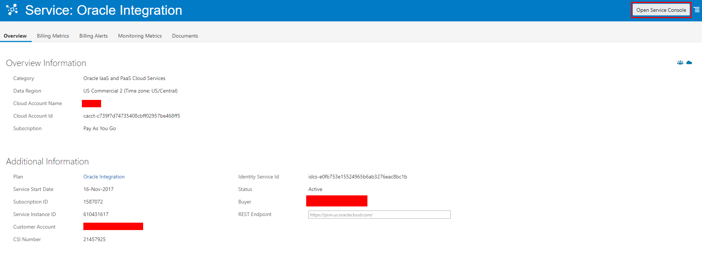
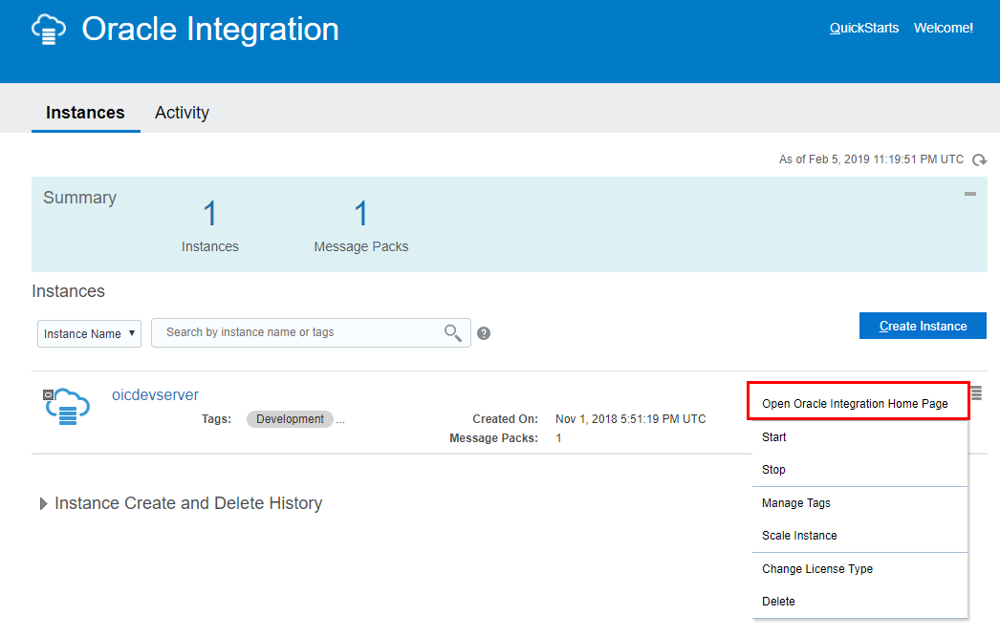
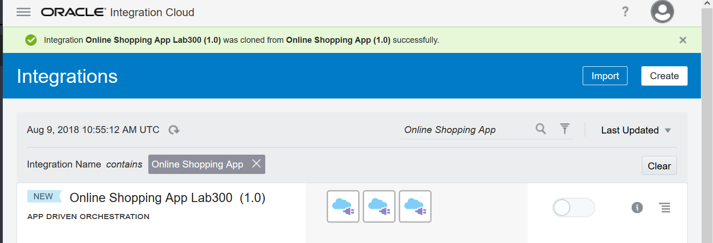
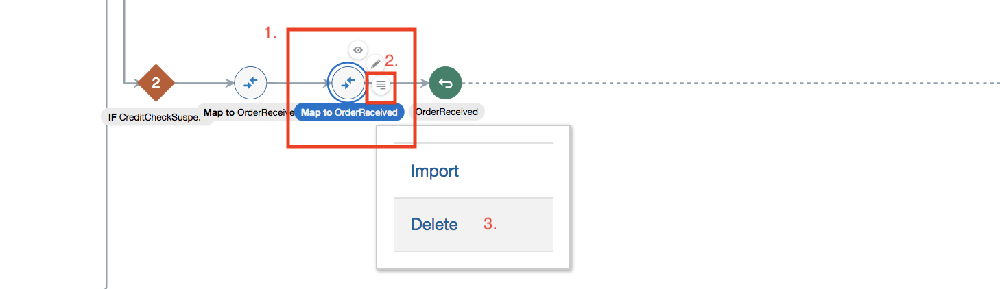
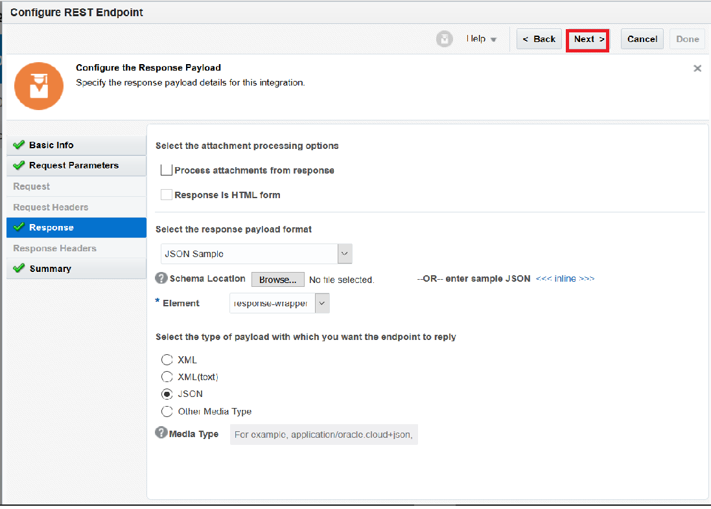
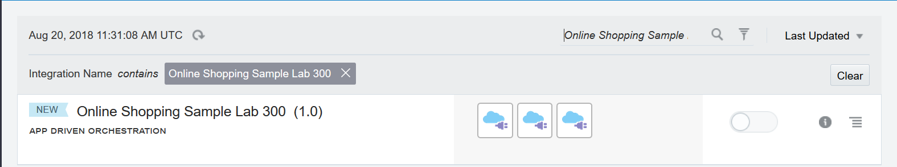
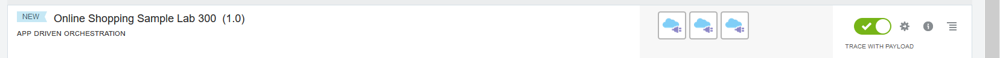
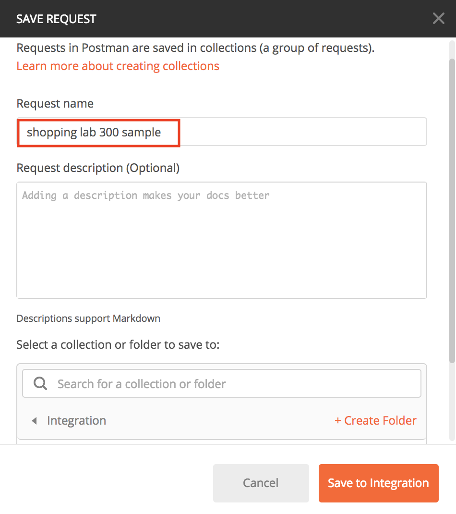

# Online Shopping Integration Flow Development

---

## Introduction

In this Lab we are going to take a sample integration flow and add additional components to finish the flow.

The OIC integration flow that we'll be building is shown in the following picture:


---
## Objectives
Take sample integration flow and add 2 conditional branches and test.

## Required Artifacts

- The following lab and an Oracle Public Cloud account that will be supplied by your instructor.

## Login to your Oracle Cloud account

### Login to OIC Integration Home Page

>***NOTE:*** Cloud Account Credentials including **User Name** and **Password** values will be given to you by your instructor. 
---

**1.1** From your browser (Firefox or Chrome recommended) go to the following URL:
<https://cloud.oracle.com>

**1.2** Click _Sign In_ in the upper right hand corner of the browser
**IMPORTANT** - Make sure `Cloud Account with Identity Cloud Service` is selected Under Cloud Account, Enter **Cloud Account Name** provided by your instructor and Click on `Next >` 


**1.3** Enter your `User Name` and `Password` and click **Sign In**

***NOTE:*** the **User Name and Password** values will be given to you by your instructor.

  

**1.4** You will be presented with a Dashboard displaying the various cloud services available to this account.

**NOTE:** The Cloud Services dashboard is intended to be used by the *Cloud Administrator* user role.  The Cloud Administrator is responsible for adding users, service instances, and monitoring usage of the Oracle cloud service account.  Developers and Operations roles will go directly to the service console link, not through the service dashboard.


**1.5** The Service Administrator can also look at Billing and Monitoring MetrAIC to understand how the service is being consumed by your Enterprise


**1.6** Selecting `View Details` link will take you to the Service Overview page where there are links for Billing and Monitoring Services. As this is a demonstration account, there is no Billing and Monitorin information available.



**1.7**  To get to Oracle Integration Cloud (OIC) service console where you will work on developing the integration, click on the `Open Service Console`. This will display OIC Service Instance Page listing all OIC Services provisioned in the Cloud Account.



**1.8**  Click on Hamburger menu for OIC Instance `<Instance Name>` and Select the `Open Integration Cloud Home Page` link to go to the OIC Welcome Page.  


### Clone and Develop your Integration

**2.1** You are already having an existing integration named **Online shopping Sample**. We will create a clone of the same integration.

**2.2** Search with above integration name as shown below. 


**2.3** Select the hamburger icon on the right and click **Clone** as shown below. 


**2.4** A new page comes up. Provide the integration name as **FirstnameLastname Online Shopping Sample Lab 300**, description if you wish to and click **Clone** button as shown in the below diagram.


**2.5** A new integration is created as shown below. 



_Now we will add two conditional branches in the same flow and test it out_

**2.6** Click on the newly selected integration and you will see an already existing workflow. Here we will add two conditional branches and test it out.


**2.7** Select **switch button** on left and click **+** as shown below 


**2.8** A new branch will be created as shown in the below diagram. 


**2.9** Click on the edit button as shown below.


**2.10** A new page comes up, provide Expression Name as **CreditCheckSuspended**. 


**2.11** Next we need to select the input parameter. Drill down and select **response** field and drop on empty box as shown below.


**2.12** Finally provide the expression parameter as mentioned below and click on **Validate** button. Your overall page should look like this. 

 ```
 "CREDIT_CHECK_SUSPENDED"
 ```


**2.13** Click **Close** button to come out of this wizard. Next, we need to map the output parameters. Select **Map** Data from Actions tab as shown. 


**2.14** Drag **Map Data** and place in swimlane as shown below.


**2.15** Select Map data and click on 'Edit' button as shown below.


**2.16** Mapper page will appear. Expand the response mapper by clicking on response link highlighted in red in the below screenshot.


**2.17** Update the response mapper and provide value as **ORDER_SUSPENDED**. Click on validate to finish the setup.


**2.18** Now go back to Main page and click on **Actions** tab. Select **Return** item as shown below.


**2.19** Next, drag and drop selected item on the same swimlane. Since we have already set up map previously (1.14), delete the newly appeared one.



Your overall setup should look like this. This completes our one - **if else** logic


**2.20** Next go to the **Invoke** tab and select **Rest** connector - `OnlineShoppingPaymentInvoke` as shown below. 


**2.21** Drag and drop connector to **Otherwise** swimlane as shown below.


**2.22** A new page will come up. Provide the below details as marked in red. 

- What do you want to call your endpoint? - **DeclinePayment**

- What is the endpoint's relative resource URI? - **/payment**

Once done, click **Next**.


**2.23** Here we need to add two input fields for request mapping. Click on **+** button and add  parameters as shown below. Click **Next** once done.

Parameters to be added: 
- **OrderId**
- **PaymentAction**


**2.24** This is the section where we need to select Response mapping. Select **JSON Sample** and click **Inline** section as marked in red.


**2.25** A blank textbox opens up. Enter a Sample Json as shown below. Click **OK** once done.

```
{"response":"PAYMENT_FAILED"}
```


**2.26** Click **Next**



**2.27** This is final step of adapter configuration. Check all the parameters and click **Done** to exit from here.


**2.28** Now we are back to Integration page. Here you will see two new items as shown below.


**2.29** Click on **Edit** button for the mapper file as shown below. 


**2.30** A new page opens up. Update the PaymentAction field with expression value as **CancelPayment**. Also map **OrderId** from source with target. Once done Next click  **Validate** to verify all the parameters. Finally select **Close** to exit from this page. 


**2.31** Now we are back to the Integration page, from here select **Return** action item as shown.


**2.32** Drag and drop to the same swimlane, your entire message flow should look like this.


**2.33** Next click on **Edit** button for response mapping as shown


**2.34** A new mapper page shows up. Update the response parameter to **ORDER_SUSPENDED** and click **Validate** to update the same. Once done click **Close** to exit the same.


**2.35** Click on **Save** and then **Close** to exit the integration design canvas.


You should see your _New_ integration in list of _Integrations_



**2.36** Click on the switch next to your integration to activate.


**2.37** On the **Activate Integration?** popup window, select **Enable Tracing**, then **Include payload**, then click on **Activate**.




**2.38** Once your integration is activated, select Cogwheel type of button (1.) and select the given url.


**2.39** You will be redirected to a new page. Copy Endpoint URL and save it for later. You are going to use it in Postman for testing your request.


### Online Shopping Integration Testing

Testing the activated integration can be done using multiple tools and depends on your preference. See each relevant product's website on how to install the tool, if its required.

### Testing your Integrations using Postman

Follow these instructions to test the integration using Postman.

**3.1** Got to URL **chrome:/apps** in _Chrome_ and open POSTMAN


**3.2** Click on the Collection tab as shown below  


Provide the name for your collection as it shown below


Click on the AddRequest tab as shown below


**3.3** Here provide the name of the Integration and optional description and click **Save**



**3.4**A new page comes up. Click on **Authorization Tab**. For Authorization type, select Basic Auth. Provide the credentials that you used to sign in to Oracle Cloud.


**3.5** Next, we need to set the request. 1. Select POST method and copy paste the Endpoint URL that you saved earlier (from 1.39). 2. Click on **Body** section and update the request json as shown below. 

```json
{"OrderId": "1235", "UnitPrice": "10000", "NumberOfItems": "3", "ShippingState": "OH", "Model": "WalkeyTalkey 1.0", "ReturnReason": "Does Not Work"}
```

Make sure you select JSON(application/json) format (5)


**3.6** Click on Send button and check the response at bottom.


**3.7** Now go back to the Integration Page  and navigate  **Tracking** field as shown below 


**3.8** Click on the order instances as shown


**3.9** You will see the overall flow  of the integration as shown 


### Testing your Integrations using Restlet Client

If you do not have Postman installed, another option to test the activated integration is through Restlet Client add-on in the browser.

**4.0** Open the browser where Restlet Client add-on is installed. Click on the purple icon with ‘R’ on it


**4.1** Restlet Client will open in the browser as shown below


**4.2** In the ‘Method’ dropdown select ‘POST’. Enter the integration Endpoint URL that you saved earlier (from 1.39) in the textbox next to dropdown as shown below.


**4.3** If the Content-Type is not already set to ‘application/json’ under the Headers section as shown below then add new header ‘Content-Type’ and set it to ‘application/json’


**4.4** Click on ‘Add Authorization’ link under the Headers section next to ‘Add Headers’ button to add basic authorization details


**4.5** Next, Click on Body section and update the request Json as shown below

```json
{"OrderId": "1235", "UnitPrice": "10000", "NumberOfItems": "3", "ShippingState": "OH", "Model": "WalkeyTalkey 1.0", "ReturnReason": "Does Not Work"}
```


**4.6** Click on ‘Send’ button and check the response at the bottom


**4.7** Now go back to the Integration Page  and navigate  **Tracking** field as shown below 


**4.8** Click on the order instances as shown


**4.9** You will see the overall flow  of the integration as shown 


You have now completed hands-on workshop for Oracle Integration Day.

- This Lab is now completed.