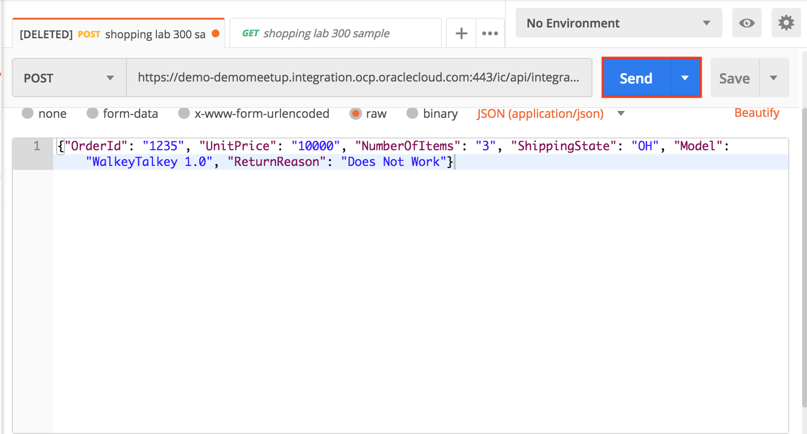
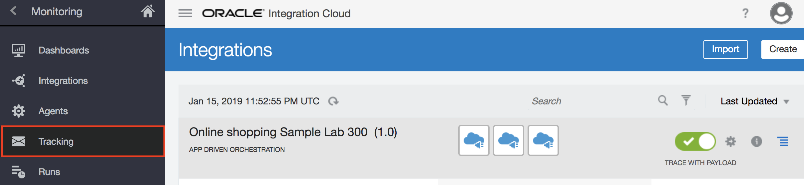
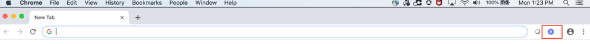
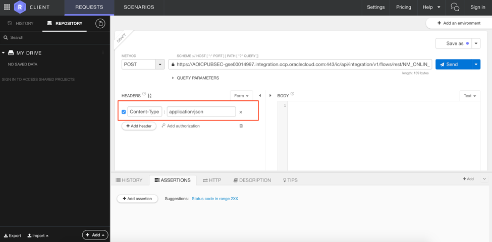
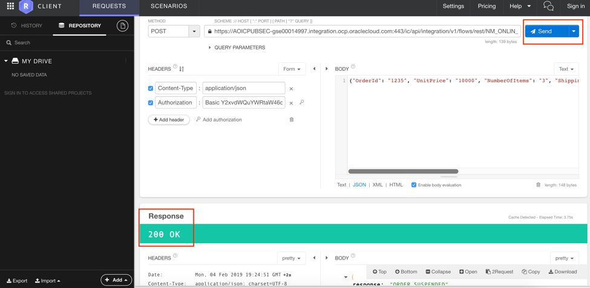

# Online Shopping Integration Flow Development

## Testing

Testing the activated integration can be done using multiple tools and depends on your preference. See each relevant product's website on how to install the tool, if its required.

### Testing your Integrations using Postman

Follow these instructions to test the integration using Postman.

**3.1** Got to URL **chrome:/apps** in _Chrome_ and open POSTMAN


**3.2** Click on the Collection tab as shown below  


Provide the name for your collection as it shown below


Click on the AddRequest tab as shown below


**3.3** Here provide the name of the Integration and optional description and click **Save**


**3.4**A new page comes up. Click on **Authorization Tab**. For Authorization type, select Basic Auth. Provide the credentials that you used to sign in to Oracle Cloud.


**3.5** Next, we need to set the request. 1. Select POST method and copy paste the Endpoint URL that you saved earlier (from 1.39). 2. Click on **Body** section and update the request json as shown below. 

```json
{"OrderId": "1235", "UnitPrice": "10000", "NumberOfItems": "3", "ShippingState": "OH", "Model": "WalkeyTalkey 1.0", "ReturnReason": "Does Not Work"}
```

Make sure you select JSON(application/json) format (5)


**3.6** Click on Send button and check the response at bottom.




**3.7** Now go back to the Integration Page  and navigate  **Tracking** field as shown below 




**3.8** Click on the order instances as shown


**3.9** You will see the overall flow  of the integration as shown 


You have now completed Lab 300 of the OIC Developer Workshop. In the next lab, we are going to create a User Interface using ABCS, then call the REST API with online shopping request.

- This Lab is now completed.

### Testing your Integrations using Restlet Client

If you do not have Postman installed, another option to test the activated integration is through Restlet Client add-on in the browser.

**4.0** Open the browser where Restlet Client add-on is installed. Click on the purple icon with ‘R’ on it



**4.1** Restlet Client will open in the browser as shown below


**4.2** In the ‘Method’ dropdown select ‘POST’. Enter the integration Endpoint URL that you saved earlier (from 1.39) in the textbox next to dropdown as shown below.


**4.3** If the Content-Type is not already set to ‘application/json’ under the Headers section as shown below then add new header ‘Content-Type’ and set it to ‘application/json’



**4.4** Click on ‘Add Authorization’ link under the Headers section next to ‘Add Headers’ button to add basic authorization details


**4.5** Next, Click on Body section and update the request Json as shown below

```json
{"OrderId": "1235", "UnitPrice": "10000", "NumberOfItems": "3", "ShippingState": "OH", "Model": "WalkeyTalkey 1.0", "ReturnReason": "Does Not Work"}
```


**4.6** Click on ‘Send’ button and check the response at the bottom




**4.7** Now go back to the Integration Page  and navigate  **Tracking** field as shown below 


**4.8** Click on the order instances as shown


**4.9** You will see the overall flow  of the integration as shown 


You have now completed Lab 300 of the OIC Developer Workshop. In the next lab, we are going to create a User Interface using ABCS, then call the REST API with online shopping request.

- This Lab is now completed.