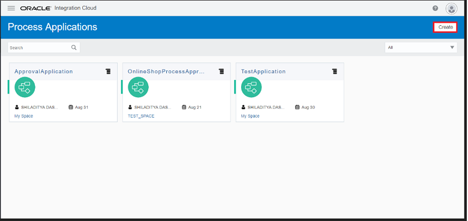
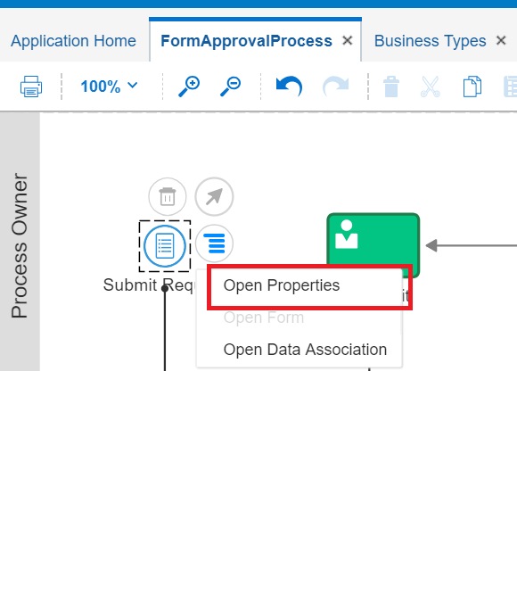
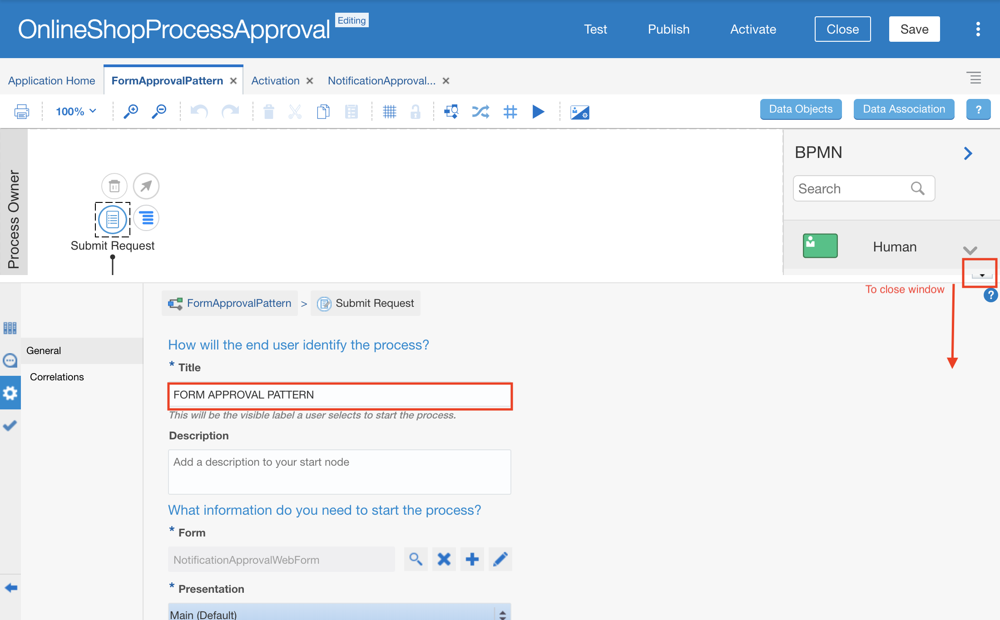
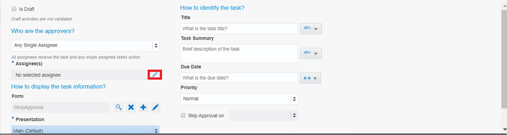
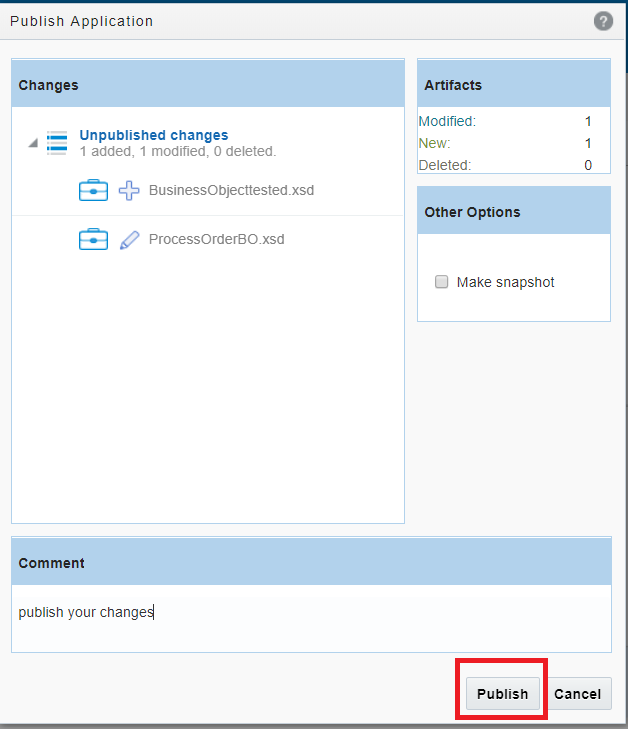
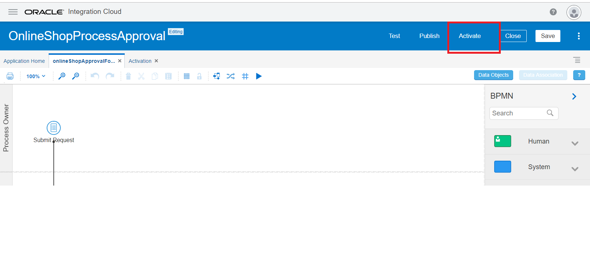

# **Lab 500: Create Approval Workflow to Process Orders**

## **Introduction**

This is the fifth of several labs that are part of the **OIC Development** workshop.

In this lab, we are going to use the Process Automation capability to implement a Business Process that will be triggered for suspended orders from online shopping API call

## **Objectives**
- Create Approval Workflow To Process Orders

## **Pre-Requisites**
- **REQUIRED:** 
    - This lab assumes that you have already completed Lab 400

## **Required Artifacts**

- The following lab  
- An Oracle Integration Cloud account (supplied by your instructor)

# **Getting Started**

## **500.1: Log In to OIC**

**500.1.1:** Navigate to the Home Page by using the OIC URL provided to you by your instructor. The URL should have the following pattern: 
https://{**InstanceName**}-{**CloudAccountName**}.integration.ocp.oraclecloud.com/ic/home/

**500.1.2:** Log in using the IDCS re-route page

 


## **500.2: Creating An Application**
**500.2.1:** In the Integration Cloud navigation pane, click **Processes** and then **Process Application** 


**500.2.2:** 
- Click on the **Create** button on top right as shown below



- Select the option **Create an Application** 
 


**500.2.3** Provide the application name as per the instruction of your lab proctor and a description if you wish 
> You can use  either use an existing Space or create a new one as per your wish.
- Click the **Create** button


## **500.3: Creating Web Forms**

**500.3.1:**  Use the forms editor to create forms for your human tasks and start form events without scripting rules
- Click on **Forms** tab as shown


**500.3.2:** Click on **Create** button as shown below 


**500.3.3:** Provide the form name _Notification_Approval_Web_Form_ and click **Create** 


**500.3.4:** The web forms editor opens in a new tab named with the title you entered for the form

> - The editor contains a central canvas on which you construct the form by dragging and dropping available controls from the palettes onto the canvas    
> - The Properties pane lets you select settings   
> - The Data pane lists data attributes for the form’s control   


**500.3.5:** To design a Web Form, you need to drag and drop the activities from Right pallet. For your form we will need **Text Area** and **Number** elements.


**500.3.6a:** To create the Order ID field, drag and drop **Text Area** to the center of the canvas


**500.3.6b:** Click on the Text Area
- Change TextArea **Label** (control name that displays to users) to `Order ID` 
	- **Name** (internal name for the controller) to `orderID` should change automatically


**500.3.6c:** Repeat the steps **500.3.6a:** and **500.3.6b:** labels with Corresponding Names:
> - `Shipping State` - **shippingState**
> - `Model` - **model**
> - `returnReason` - **returnReason**
> - `Status` - **status**

**500.3.7:** Drag and drop the _Number_ Basic Palette item twice to create `Unit Price` and `Items Number`:
> - `Unit Price` - **unitPrice**
> - `Items Number` - **unitPrice**


> All of the fields will appear as you outlined below. Verify all the parameters then save


> - Click on the _`Preview`_ button to view the webform in various devices


## **500.4: Creating Process Flow**

**500.4.1:** To design the flow, select the **`Process`** Tab from the menu items  


**500.4.2:** You will be redirect to the process flows and its various options
- Select the **`Form Approval Pattern`** 


**500.4.3:** Provide a name for the process and select **`Create`** as shown below


**500.4.4:** The sample flow that is provisioned is shown below in the diagram


**500.4.5:** For this workflow, a user needs to either approve or reject based on input parameter. 
- Edit/Delete the remaining items until it resembles the final image as shown below


 

**500.4.6a:** Next, start designing the business process
 - From the **Process Owner** swimlane, double click on the **`Submit Request`** event to reveal selection items


**500.4.6b:** Select the `hamburger` icon  and click on **`Open Properties`**



**500.4.6c:** A half page canvas will reveal itself   
- Navigate to the **Forms** section
- Click on the **`Search`** icon 
- Select the web form created in earlier steps
- Give it a Title




**500.4.7:** Close the window to return to the main flow 
- Double click on the **`Submit Request`** event to reveal selection items
- Select the `hamburger` icon 
- Choose **`Open Data Association`** from the dropdown  


> Data association refers to the flow of data within a process. We Use the Data Association editor to define the input and output flow of data on the elements. Here, we will not need to make any changes. The left plane displays the input parameters (source) and right plane displays data objects in an expandable tree (target). 

- Click **`Cancel`** to exit from this section


**500.4.8:** From the main flow, 
- Click on the **`Approve Request`** task 
- Select the `hamburger` icon 
- Choose **`Open Properties`** from the dropdown


**500.4.9:** A half page canvas will reveal itself  
- Navigate to the assignee section
- Add a new approver by following the images below




**500.4.10:** In the same window,
- Navigate to the **Forms** section
- Click on **Search** icon 
- Select the web form created in earlier steps
- Click **OK** to close 


**500.4.11:** From the main flow, 
- Click on the **`Approve Request`** task 
- Select the `hamburger` icon 
- Choose **`Open Data Association`** from the dropdown


> The left plane displays the data objects and right pane displays payload or input parameters. We will not need to make any changes so you can click **`Cancel`** to exit from the section

This completes the workflow development


## **500.5: Save, Publish and Activate Changes**

**500.5.1:** Click **Save** on top right of the process flow to commit all your work to the system


**500.5.2:** To stage the changes
- Click **Publish** 
- In the window that opens, provide a comment
	- Select the **Publish** button as shown below




**500.5.3:** Your application will need to be deployed in order to test it 
- Click **Activate**



**500.5.4:** Follow the remaining steps as shown below sequentially to complete your activation

- In the new tab that opens, select **`Activate New Version`**


- In the new window that opens, select **`Validate`**


- Upon successful validation, click on **`Options`**


- For the activation options, provide a revision ID (i.e. - 1.0)  
- Check use Fault Policies
- Click **`Activate`**


**500.5.5:** To prepare your applocation for testing, we need 
1. An administrator permission - if you are an administrator you are going to be given that permission by default
2. To access a WSDL url

- First, from Integration Cloud home page, click on **`Processes`**


- Second, click on **`Process Applications`**  
- Select **`Activate`** (located next to the Create button)


**500.5.6:** You will be redirected to a page where you will be able to see all the deployed applications. 
- Find the one you deployed and click on **`Webservices`** in the dropdown revealed after clicking the hamburger icon


**500.5.7:** Under the exposed tab, you will see an endpoint url. Copy and paste then return to the OIC Home Page


## **500.6: Assigning Roles**

**500.6.1:** In this section we will assign roles to end users and define their permissions to start an application. 

- Scroll down and select **`Tracking`** from under the Process Health Section as illustrated below


**500.6.2:** 
- Select **`Administration`** from the menu panel


- Select **`Manage Roles`** from the new list of items


**500.6.3:** Navigate to the **Process Roles** tab and search for your application 


**500.6.4:** From the list, select **`Reviewer`** and add the required user by clicking **`Add Member`**


**500.6.5:** A new tab will open where you will search for a name that is associated with that Oracle Account ***(This name is given to you by your instructor)***
- Select the checkbox and Click **OK** to add the user
- Repeat this process for as many users as you have been instructed to add (Process Owner and Viewer)
> ***NOTE:***  After each addition of a user, **Save** the changes.


## **500.7: Test Your Applications**

**500.7.1:** Test your applications using Postman. 
- Open Postman 
- Open a new tab or Update the endpoint url as shown below. 
- Select the Authentication type as **Basic Auth** 
- Set the HTTP verb as **POST**


**500.7.2:** Click on the **Body** tab and paste the sample JSON provided below

- Once completed, click the **Send** button

````
{
	"processDefId":"oracleinternalpcs~OnlineShopProcessApproval!1.4~OnlineShopApprovalForm",
	"serviceName":"OnlineShopApprovalForm.service",
	"operation":"submitRequest",
	"action":"Submit",
    "payload" : "{ \"orderID\":\"Form description1\",\"unitPrice\":\"100\",\"shippingState\":\"shipped1\",\"noOfitems\":\"201\",\"status\":\"returned\",\"returnReason\":\"bad-product1\",\"model\":\"x1241\"}"
}
````  


**500.7.3:** In the console, you should see a **200OK** status to signify success


**500.7.4:** Navigate back to the OIC Home Page and Select **`My Tasks`**


**500.7.3:** Given your access role, you should see a list of task pending approval


**500.7.4:** Select one to be navigated to a detailed page.
- You will see a complete list of input parameters which were passed from Postman
- Review the details and features on this window
- Choose to **Approve** or **Reject** the task


---

# **THIS LAB IS NOW COMPLETED**
> In the next lab, we are going to use VBCS to invoke the Approval Workflow when a suspended order is returned from from Online Shopping API.